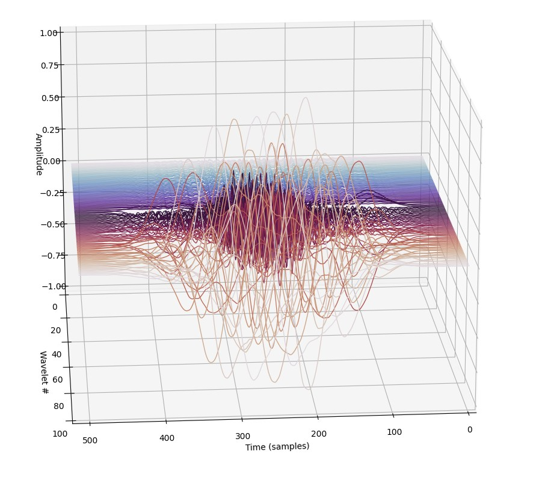

Learned Wavelet Filterbanks
=== 

### Overview

This project explores the possibility of a deep learning model to jointly learn:
  - a bank of **wavelets**, or set of signal "fragments", that can be linearly combined to produce arbitrary signals   
  - the **weights** for that linear combination, given a particular signal window under analysis

    
### Motivation
  
These weights can be used as features for downstream audio tasks, like classification, or in generative models. Because these weights are sparse, storing just the top 10 may reconstruct the signal with good fidelity, giving 25:1 compression.
  
The weights produced for a particular audio signal are similar to the power spectrum of a time-frequency transform, 
so they can be used similarly as high level features of the audio signal. 

Unlike the Fourier Transform which reveals 
patterns primarily in the power spectrum (the other half of the information in its phase spectrum is largely chaotic), 
this learned wavelet spectrum contains *all* the information in one image; this can lead to generative models trained on 
this spectrum to have better phase-coherence -- less "mushy" sound -- than the alternatives which usually use 
the Griffin-Lin algorithm to conjure phases out of nothing. 

### Visualization

---

An example learned filterbank:

--- 

Plotting the weights over time against a FFT spectrogram. These plots are transforms of the same signal and same time interval. 
Notice how you can zoom in much further to resolve details, and achieve better time-frequency specificity than FFT, although 'frequency' is approximated.

Also note how sparse the 'learned wavelet transform' is compared to FFT, enabling the potential for high compression.  

## 
